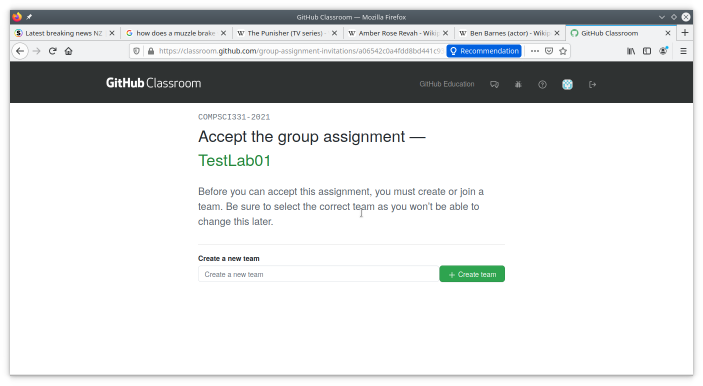
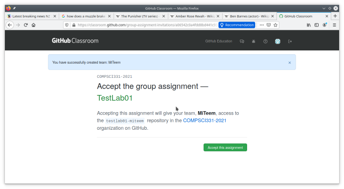
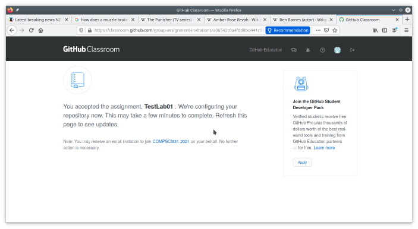
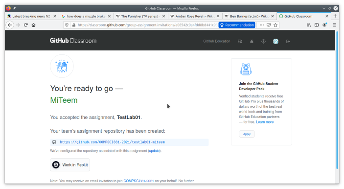
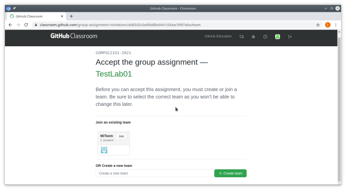
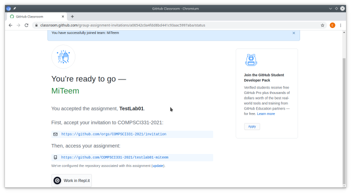
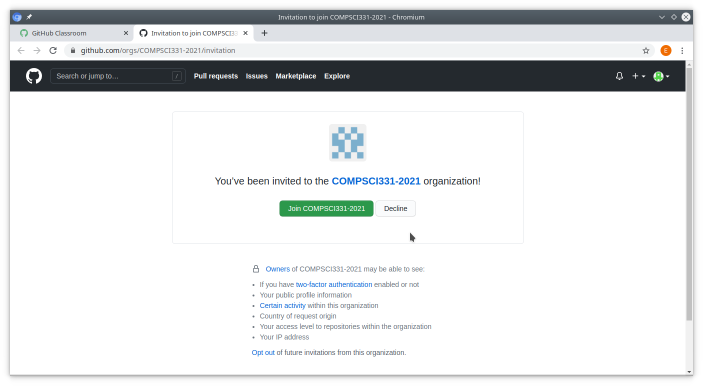

Github - Joining Teams
======================

For this course, you will be working in teams for the labs and project. This
briefly illustrates the process for getting the teams and your membership set
up.

1. You will receive a link for the repository template for your team. Open the
link from a browser.

1. You will be asked to authenticate (if you aren't already authenticated to Github)

1. You now go through the process to accept the group assignment.  First you
must either create or join a team. If your team does not already exist, you
must coordinate with your team members so determine who will go first.  That
person will put your team name into "Create a new team" and click "+ Create
team".

    

1. The next step is to accept the assignment. This will lead to the team repository being set up.

    

1. You'll need to refresh the page after a minute or so to determine when the process is completed.

    

1. When the configuration process is complete your repository will have been created. It should be visible on your Github account, and you can clone it to your local computer. The name will be made up of the assignment name and your team ("testlab01-miteem" in the image).

    

1. Those joining the team after it has been set up will see something slightly different. The team name should now be listed on the first page
(MiTeem in the figure) so choose your team.

    

1. This puts you in the team. but now you also need to
accept the invitation to the organisation (if you created the team this
seems to happen automatically).

    

1. Complete the invitation process.

    
