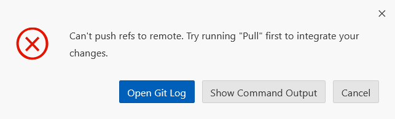
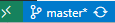
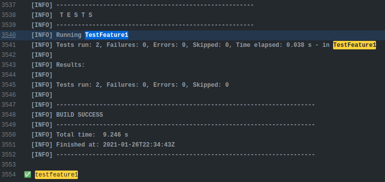
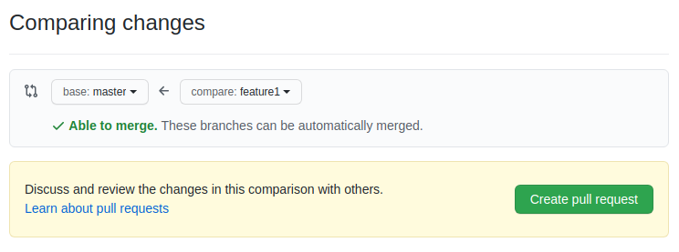
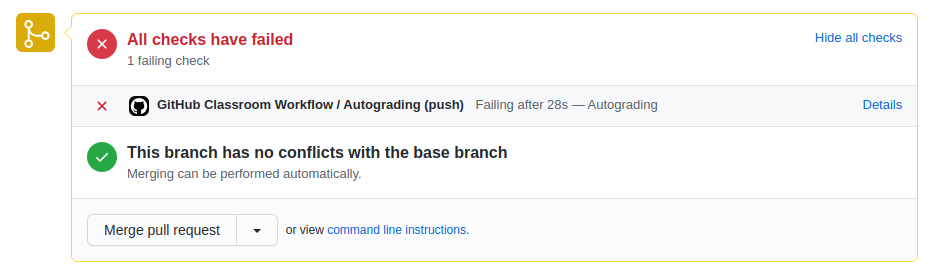
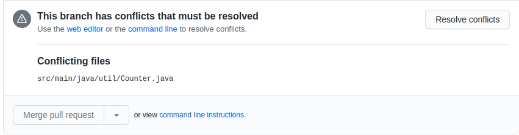
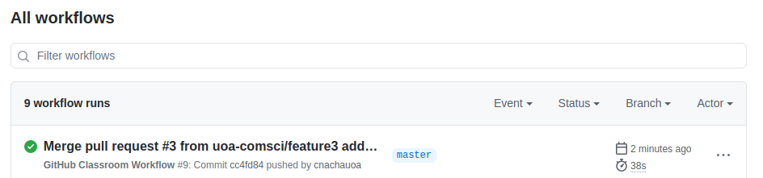

Team Git
======================

This lab explores the use of git (and GitHub) by a team. It assumes you are already familiar with the basics of git. Make sure to look at the details of assessment at the end of this file.

You will need to set up your teams. This process is described [here](JoiningTeams.md)      

Issues arise when multiple people use the same git repository. The exercises in the lab explore some of them. It assumes you are working in a team of 3, consisting of team members Dev1, Dev2, and Dev 3.

## Exercise 1 - Basic Git

For this exercise the three team members will individually complete the tasks
below to fix faults in their own copy of the repository. The issue is then how
to combine all of the changes into a single version on the remote repository.

***Task 1: Increment Fix***
Fix the faulty in Counter increment(). All code changes and relevant commits must be performed on the master branch.

***Task 2: Decrement Fix***
Fix the faulty in Counter decrement(). All code changes and relevant commits must be performed on the master branch.

***Task 3: Reset Fix***
Fix the faulty in Counter reset(). All code changes and relevant commits must be performed on the master branch.

Each team member makes the change, commits it to their local repository (of
course making meaningful comment messages!) and then attempt to push the
changes to the remote repository. The first one should work without problems,
but for the second and third, the local repositories are now out of date with
respect to the remote repository. Note that all of this should be done on a
the master branch. Using separate branches is in a later exercise.

<ol>
  <li>Dev1,2,3 - clone the project to the local repository. 
  <li>Dev1,2,3 - performs tasks 1, 2 and 3 (below) respectively on their own local source code</li>
  <li>Dev1 - stage, commit and push the changes for task 1</li>
  <li>Dev2 - perform code synchonisation as explained below and push the changes for task 2</li>
  <li>Dev3 - perform code synchonisation as explained below and push the changes for task 3</li>
</ol>

#### Clone on VS Code ####
On VS Code, go to the Source Control tab and click on the three dots. Then, click on Clone Repository and enter the URL of the repository. After that, click on the three dots again and click on Pull. This will pull the source code from the remote repository to the local repository.

#### Testing ####
There are four test scripts in /src/test folder. The `TestCounter` is for testing changes you have to perform for this exercise, while the others are for the next exercise. You should read the source code in this test script and find the test method that test your task, for example, `testIncrement()` is for testing Task1. After you make the change according to your task, you can execute this test script by running Maven with the `test` goal. This will compile and run all tests on the project. The task is complete when the test relevant to the task passes.

#### Code Synchonisation

When Dev2 and Dev3 try to commit and push their changes, the push should be fail and show the error as shown in the figure below. This is because Dev1 has already pushed the source code to Git so the source code that Dev2 and Dev3 have is not in sync with the code on the remote repository. Github does not allow you to push the source code for this reason and therefore rejects the attempt.




**How to solve this**: What Dev2 and Dev3 now need to do (first one, then the other, otherwise the
same problem will occur) is perform a 'pull to merge'. 

This can be done by "pull (Rebase)" clicking on three-dotted icon in the source control and choose.

After pull (rebase), the changes should be merged.

Once both Dev2 and Dev3 have resolved the conflicts this exercise is complete. Please continue the next one. 

## Exercise 2 - Git Branches

For this exercise, the three developers will again make three changes (this time adding features), but this time on different branches. 
**Before starting this exercise, please make sure that all three developers pull the latest source code from the repository.**

Feature 1 by Dev1 is to implement the increment method **incrementToEven()** that increases the counter to the next even number, and implement the decrement method **decrementToEven()** that decrease the counter the previous even number.

Feature 2 by Dev2 is to implement the increment method **incrementToPrime()** that increases the counter to the next prime number, and implement the decrement method **decrementToPrime()** that decrease the counter the previous prime number.

Feature 3 by Dev3 is to implement the **countFrequency()** method. This method count the number of words in the given sentence. Dev3 should also consider refactoring the code implemented by Dev1 and Dev2. The code refactoring should improve the overall quality of source code such as getting rid of duplicate code, apply the standard code convention, and so on.

#### Development Process

Each dev works on these features on three separate branches, namely feature1, feature2 and feature3, before merging them into the master branch. The overall process is:

<ol>
  <li>Dev1,2,3 - clone the project to local repository</li>
  <li>Dev1,2,3 - implement feature 1, 2 and 3 respectively locally</li>
  <li>Dev1 - stage, commit and push changes on the feature1 branch</li>
  <li>Dev2 - stage, commit and push changes on the feature2 branch</li>
  <li>Dev3 - stage, commit and push changes on the feature3 branch</li>
  <li>Dev1,2,3 - create a pull request to merge from their own branch to the master branch</li>
  <li>team leader approves the pull requests</li>
</ol>

#### New Branch

Each dev needs to create a branch for the feature they are implementing as named above. In VSCode's Source control, click on three dots and click on Branch > Create branch. Then, enter the name of the branch. After that, click on "Publish branch" to push the branch to the remote repository.


#### Testing
Once you have made the changes needed, you can test your feature. There are three test scripts in place namely TestFeature1, TestFeature2 and TestFeature3 for testing each feature.  One feature can be tested on a branch by using the goal in maven as **-Dtest=[test script] test**. For example, **-Dtest=TestFeature1 test** is for testing feature 1.

#### Commiting on Branch
When your test passes, commit your changes on your branch.  Make sure you are on your
own branch before making a commit. As figure below shows, you can see the branch you are currently on by looking at the bottom left of the VSCode window, as shown in figure below.



On Github, make sure you are on the right branch by choosing the branch in the dropdown menu as shown below.


#### Github Workflow
After commiting the source code to a branch, Github classroom workflow (CI) will be executed. The figure below shows the log file (it also can be accessed from Github's Actions tab, click on "Autograding" in the center of the page). After Dev1 has committed on feature1 branch; this shows testfeature1 has succeeded, while testfeature2 and testfeature3 has failed. Similarly, the execution of feature2 branch should have testfeature2 succeed, while testfeature1 and testfeature3 fails.  



There are a number of tutorials available on-line. A reasonable one
(although with more detail than needed for this lab) is by [Atlassian](https://www.atlassian.com/git/tutorials/using-branches)

#### Pull Request ####

The implementation of new features are separately stored on different branches. In order to combine all implementations, the branches for each feature needs to be merged into the master branch. To achieve this, each dev creates a pull requests on Github by going to Pull Request tab and click 'new pull request'. Then, select the branch to merge into master branch. Github will show the comparison of files on master branch and feature branch as the figure below.



If there is no conflict in the files, the branches can be automatically merged. However, if there is any conflict, the developer must resolve it when approving the pull request. This is done by clicking on 'Create pull request' and entering the message of this pull request for later approval.



On the approval as shown above, Github informs us that there is no conflict so we can choose to merge the pull request. However, if there is conflict as sample shown below, the conflict must be resolved before it can be merged into the master.




After that, the implementation of the feature will be added into the master branch. This process must be repeated for all three features.

***Note***: You might not see the branches that the others created. Please run the following command in the project root folder:

```
git fetch --all
```
  
## Build & Run project on GitHub ##

To see the result of building and running tests on Github, go do the Action tab. GitHub Action is the CI-CD (continuous integration - continuous deployment) pipeline provided by GitHub. It is similar to other CI-CD pipeline platforms, e.g. Travis CI or Jenkins. In this project, there is a workflow already defined namely Github Classroom, as shown in the figure below. Every time code is pushed to the repository, this workflow will be queued to execute automatically. When this workflow runs successfully (as shown below), the exercise is complete.



<h2>Assessment</h2>

The marking of this lab will be based on your team repository as of Friday 20
August 1700hrs. As well as the changes made to it for the above exercises, you
must include a file <tt>Team.md</tt> containing the list of members in your
team and a brief summary of what role each member played. For example:

* 6100000011 Ewan - Dev1 in exercise 1, Dev3 in exercise 2
* 6100000012 Paramvir - Dev3 in exercise 1, Dev2 in exercise 2
* 6100000013 Nacha - Dev2 in exercise 1, Dev1 in exercise 1

If this file is not provided then there will be a 50% penalty.

Assessment will be performed by examining the commit logs and other
information associated with your team repository.  You must demonstrate that
you have engaged with the lab material and fully participated with the
team. This means we expect to see non-trivial commits, with meaningful commit
messages, corresponding to each exercise. Different team members will do
different things and different times, but we will be looking for evidence that
there was cooperation and collaboration. Examples including making useful
commits, and commenting on actions by other team members.
